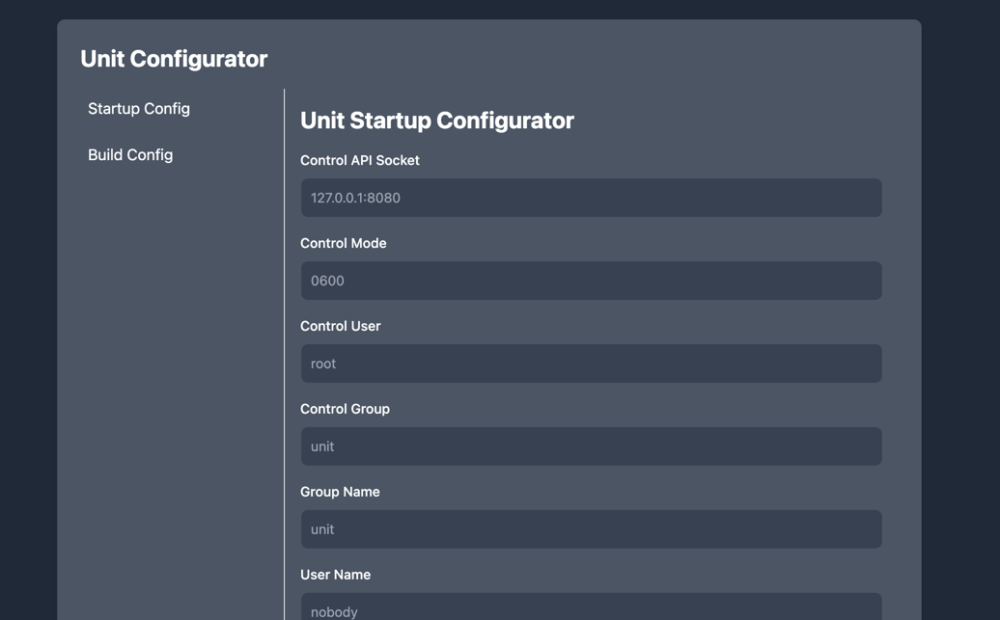

# Nginx Unit Configurator



## About

This is a simple tool to generate Nginx Unit configuration for startup and build.

## Run

To run the `index.html` file, you have multiple options:

### 1. Using a Simple HTTP Server

- **Python (v3.x)**:
  ```bash
  python3 -m http.server
  ```
  Open your browser and navigate to `http://localhost:8000`.

- **Node.js (http-server)**:
  Install `http-server` globally if not already installed:
  ```bash
  npm install -g http-server
  ```
  Then, run:
  ```bash
  http-server
  ```
  Open your browser and navigate to the provided URL.

- **PHP Built-in Server**:
  ```bash
  php -S localhost:8000
  ```
  Open your browser and navigate to `http://localhost:8000`.

### 2. Opening Directly in the Browser

- Simply double-click or open the `index.html` file in any modern web browser (e.g., Chrome, Firefox, Safari). Note that
  some advanced features might not work properly due to browser file restrictions.

### 3. Using Docker

- Create a `Dockerfile`:
  ```Dockerfile
  FROM nginx:alpine
  COPY index.html /usr/share/nginx/html/
  ```
  Build and run the Docker container:
  ```bash
  docker build -t my-html-app .
  docker run -d -p 8080:80 my-html-app
  ```
  Open your browser and navigate to `http://localhost:8080`.

### 4. Using Nginx

- Add the following to your Nginx configuration file:
  ```nginx
  server {
      listen 80;
      server_name localhost;

      location / {
          root /path/to/html/files;
          index index.html;
      }
  }
  ```
  Restart Nginx and open your browser to the configured URL.

Choose the method that best suits your environment!

## Contributing

1. Fork it!
2. Create your feature branch: `git checkout -b my-new-feature`
3. Commit your changes: `git commit -am 'Add some feature'`
4. Push to the branch: `git push origin my-new-feature`
5. Submit a pull request :D

## License

MIT License - see the [LICENSE](LICENSE) file for details.